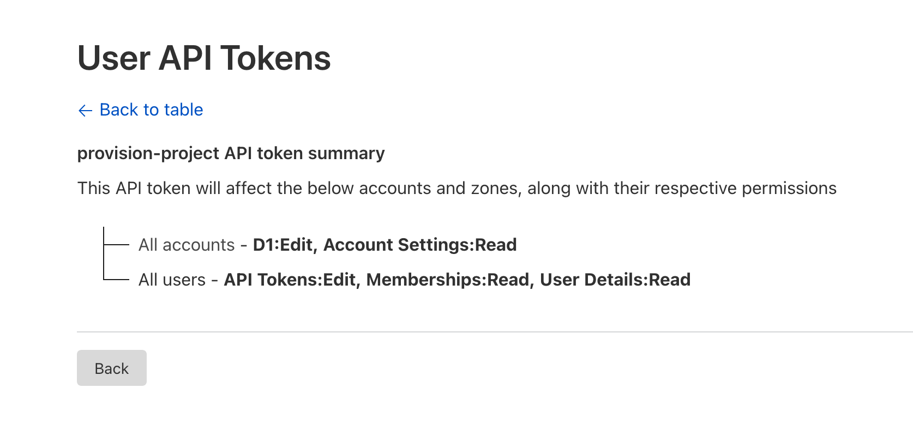

# Provision Project
Repositorio para crear aplicaciones con [SvelteKit](https://kit.svelte.dev/), desplegados en [Cloudflare Workers](https://workers.cloudflare.com/).

Los servicios de lo que se hacen uso son:
- Cloudflare
- MongoDB Atlas
- Auth0

Todos tienen un plan gratuito que se puede utilizar para este proyecto.

## Requisitos mínimos

- Terraform: Se recomienda usar [tfenv](https://github.com/tfutils/tfenv) para manejar las versiones de Terraform.
- `CLOUDFLARE_API_TOKEN`: Se crea desde la [consola de Cloudflare](https://dash.cloudflare.com/profile/api-tokens). Los permisos necesarios son:
    - All accounts - D1:Edit, Account Settings:Read
    - All users - API Tokens:Edit, Memberships:Read, User Details:Read

- `GITHUB_TOKEN`: Se crea desde la [configuración de GitHub](https://github.com/settings/tokens)

